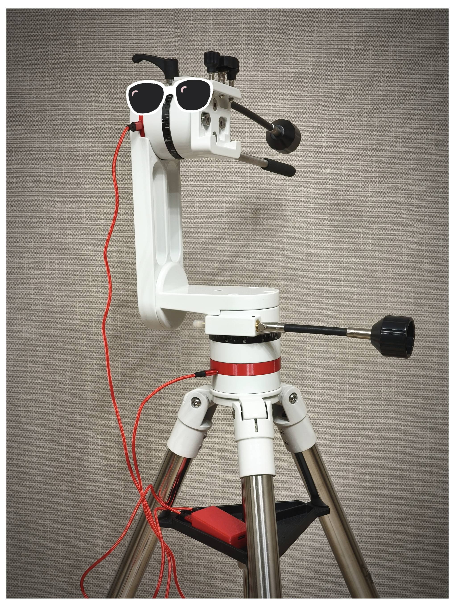

# Проект модернизации альт-азимутальной монтировки телескопа Svbony sv225 до системы Push-To

DIY проект по превращению ручной альт-азимутальной монтировки в интеллектуальную систему наведения "Push-To" с привязкой к звездам.

    

## 📋 Оглавление

## 🚀 Обзор проекта

Этот проект представляет собой модернизацию стандартной ручной альт-азимутальной монтировки Svbony sv225 в систему Push-To.

### Что такое Push-To?
Это система, которая показывает наблюдателю направление вращения ручек монтировки телескопа (после привязки к опорной звезде(-ам)), для наведения на любой звездный объект.
Это значительно упрощает поиск тусклых галактик, туманностей и звездных скоплений, невидимых невооруженным глазом. 
А так же сильно помогает новичкам - астрономам для поиска объектов.

### Отличие от Go-To
В Go-To системе, монтировка сама наводится на объекты звездного неба за счет моторизированных приводов - это следующая ступень автоматизации и упрощения наведения.
В Push-To мы привязываемся к звездному нему и далее путем ручного вращения монтировки переходим от одной цели к другой, сопоставляя данные в программе-планетарии.

### Как это работает?
На осях монтировки установлены датчики угла поворота (энкодеры). 
Микроконтроллер ESP32 считывает их показания, вычисляет кол-во шагов и передает данные в программу планетарий. 
Результат - программа планетарий видит изменения положения монтировки.

## 📎 Функциональные возможности
- Поддерживаемые программы планетарии: SkySafari (подключение по протоколу Encoders)
- Подключение по Bluetooth
- Подключение по Wi-Fi (опционально, необходимо заливать отдельную прошивку)

## ⚙️ Компоненты и материалы
- Микроконтроллер ESP32 DevKit (1 шт)
- Абсолютные магнитные энкодеры MT6701 (2 шт)
- Увеличенные магниты для энкодеров (по желанию, позволят увеличить точность) (2 шт)
- USB-C порты (4 шт) 
- Удлиненные болты в дюймовой системе, размер 1/4-20, длинна 1-1/8" (6 шт)
- Подшипник игольчатый 6*19 (2шт)
- Смазка ЦИАТИМ-F
- 3D печатные детали

## 💻 Программное обеспечение
Проект написан на C++/Arduino для платформы ESP32.

## 🔧 Сборка и установка
Перед модернизацией монтировки необходимо довести механику монтировки до возможного идеала, в моем случае я заменил смазку и избавился от люфтов путем добавления упорного подшипника.

### Замена смазки
Перед непосредственно самой сборкой необходимо полностью заменить заводскую смазку, так как заводская очень сильно дубеет на холоде уже при минимальных отрицательных значениях.
Рекомендуемая смазка ЦИАТИМ-F - наиболее дешевая из аналогов и не оказывающая сколь-либо значимого влияния на материал монтировки - алюминий.

### Устранение люфтов
Люфты получилось убрать путем добавления упорного игольчатого подшипника 6*19 (2мм толщина) под самоконтрящуюся гайку. Опытным путем устанавливается зазор, чтобы вращение монтировки было достаточно свободным, в то же время не было паразитных люфтов.
При такой доработке 

### Модернизация и сборка
Подробная инструкция по сборке здесь

## 🖨️ 3D модели

Все модели для печати можно найти [здесь](./models/STL)

## 🎯 Как пользоваться

## 📞 Связаться с автором

- телеграм: https://t.me/redstar01 (Павел Красноперов)

## ❤️️ P.S. Если вам понравился проект, поставьте звезду на GitHub!
