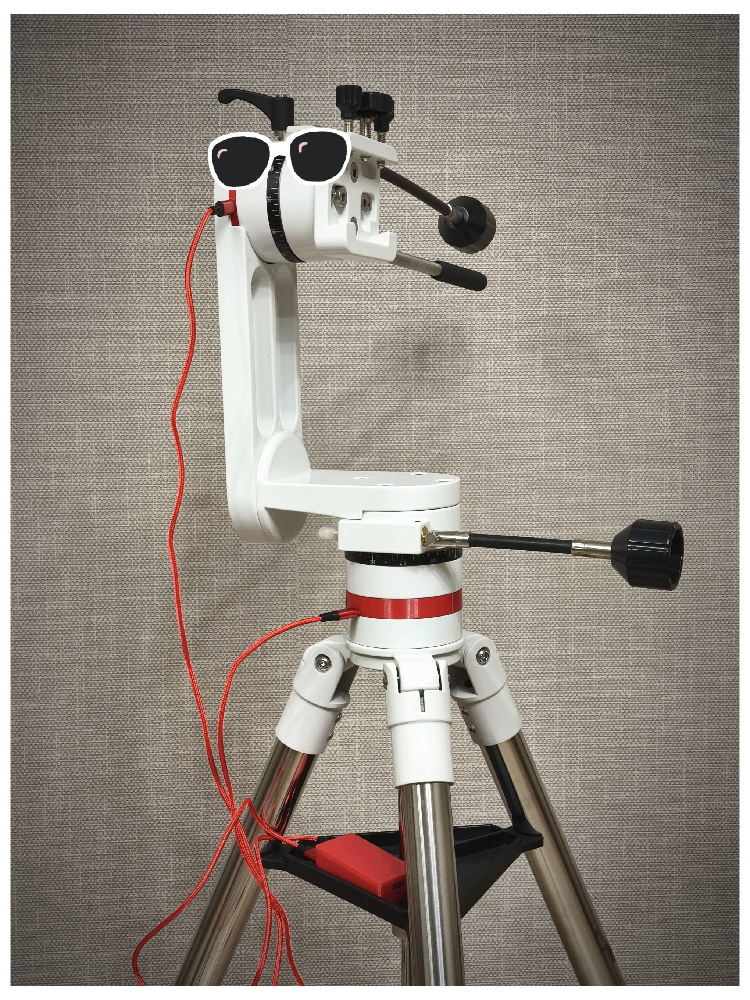
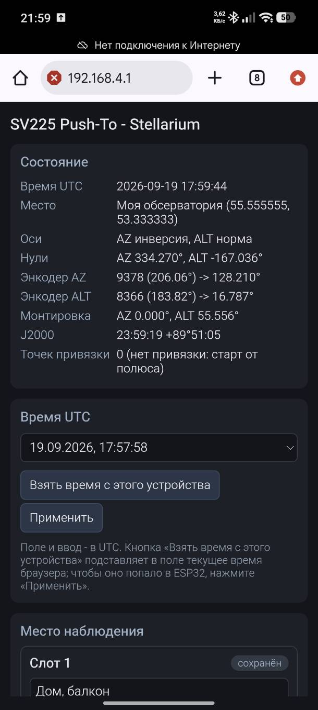

# Проект модернизации альт-азимутальной монтировки телескопа Svbony sv225 до системы Push-To

DIY-проект: обычная ручная альт-азимутальная монтировка превращается в Push-To с привязкой к звёздам. ESP32 с двумя магнитными энкодерами MT6701 отдаёт положение осей в **Stellarium** (USB, протокол Meade LX200) или **SkySafari** (Bluetooth / Wi-Fi).

    

## 🆕 Что нового: версия для Stellarium (beta)

Проект развивается в сторону **Stellarium** — эта версия уже приоритетная и рабочая (beta). Прошивки для SkySafari остаются стабильными и поддерживаются.

- **Подключение по USB** — не нужны Bluetooth, сопряжение и телефон: Stellarium видит ESP32 как монтировку Meade LX200.
- **Вся астрономия считается на ESP32** — звёздное время, прецессия J2000, перевод «углы осей ↔ RA/Dec».
- **Настройка с телефона по Wi-Fi** — страница `https://192.168.4.1/`: время UTC одной кнопкой, три слота места наблюдения с GPS, калибровка осей, живая таблица состояния.
- **Привязка к звёздам** (Sync из Stellarium) — до 6 точек, от 3 точек линейная модель по МНК; повторный Sync уточняет точку, а невязки и удаление — в веб-таблице.
- **Старт от полюса** — до первой привязки крест визирных нитей стоит у Полярной и следует за монтировкой.
- **Перевал через зенит** — координаты не «замирают»: прошивка отражает точку наведения, и крест продолжает двигаться.

    
     
    <em>Веб-интерфейс: состояние, время, слоты места и привязка — всё с телефона</em>

<!-- СКРИНШОТ: положите снимок главного экрана веб-интерфейса в ./photos/webui_main.png -->

## 🚀 Обзор проекта

### Что такое Push-To?
Это система, которая показывает наблюдателю направление вращения ручек монтировки (после привязки к опорной звезде(-ам)), для наведения на любой звёздный объект.
Это значительно упрощает поиск тусклых галактик, туманностей и звёздных скоплений, невидимых невооруженным глазом.
А так же сильно помогает новичкам - астрономам для поиска объектов.

### Отличие от Go-To
В Go-To системе, монтировка сама наводится на объекты звездного неба за счет моторизированных приводов - это следующая ступень автоматизации и упрощения наведения.
В Push-To мы привязываемся к звездному небу и далее путем ручного вращения монтировки переходим от одной цели к другой, сопоставляя данные по наведению в программе-планетарии.

### Как это работает?
На осях монтировки устанавливаются датчики угла поворота (энкодеры).
Микроконтроллер ESP32 считывает их показания и передает данные в программу планетарий — та видит изменения положения осей и показывает, куда смотрит труба.
Для Stellarium пересчёт углов в координаты J2000 и модель привязки считаются прямо на ESP32.

## 📎 Функциональные возможности

### Stellarium — beta, приоритетное направление
- Протокол Meade LX200, подключение по USB (9600 8N1) — без Bluetooth и сопряжения.
- Координаты J2000; вся математика на ESP32: GMST/LST, прецессия (IAU 1976), alt-az ↔ RA/Dec.
- Привязка Sync: 1 точка — постоянные смещения, 2 — усреднение, 3+ — линейная модель (МНК), всего до 6 точек.
- Веб-интерфейс по Wi-Fi: время UTC, 3 слота места с названиями и GPS, калибровка осей (инверсия, нули), список привязок с невязками.
- Старт «от полюса» без привязки; перевал через зенит/надир не ломает наведение.
- Не нужны интернет и приложение на телефоне: USB-кабель и ПК со Stellarium.

### SkySafari — стабильные версии
- Протокол Basic Encoder System.
- Подключение по Bluetooth (удобно тем, что Wi-Fi остаётся свободным для интернета).
- Подключение по Wi-Fi (опционально, необходимо заливать отдельную прошивку).

## 💻 Программное обеспечение

Проект написан на C++/Arduino для платформы ESP32. Исходные коды [здесь](./src).

| Прошивка | Планетарий | Подключение | Статус |
|---|---|---|---|
| [stellarium_firmware.ino](./src/stellarium_firmware.ino) | Stellarium | USB (LX200) + веб-настройка по Wi-Fi | beta, приоритет |
| [bluetooth_firmware.ino](./src/bluetooth_firmware.ino) | SkySafari | Bluetooth | стабильно |
| [wifi_firmware.ino](./src/wifi_firmware.ino) | SkySafari | Wi-Fi | стабильно |

Инструкции: [подключение Stellarium](./tutorials/stellarium_connection.md) · [подключение SkySafari](./tutorials/skysafari_connection.md)

## 🎯 Как пользоваться

### Stellarium
Подробная инструкция — [tutorials/stellarium_connection.md](./tutorials/stellarium_connection.md).

1. Прошейте [stellarium_firmware.ino](./src/stellarium_firmware.ino): плата **ESP32 Dev Module**, схема разделов — стандартная (или «Huge APP (3MB No OTA/1MB SPIFFS)» для запаса).
2. Подключите ESP32 к ПК по USB. В Stellarium: плагин **Telescope Control** → «LX200 (compatible)» → «Послед. порт» → равноденствие **J2000**.
3. Задайте время и место: Wi-Fi **`redstar01`** (пароль `1234567890`) → `https://192.168.4.1/` (браузер один раз предупредит о самоподписанном сертификате). Кнопка «Взять время с этого устройства» → «Применить»; в слоте места — «Взять GPS» → «Использовать».
4. Наведите монтировку на звезду, выберите её в Stellarium и нажмите **`Ctrl+Shift+1`** (Sync). Повторите для 2–3 звёзд, разнесённых по небу.
5. Вращайте ручки — крест визирных нитей двигается по небу. Выберите объект и подводите трубу вручную.

До первой привязки крест стоит на полюсе мира (рядом с Полярной) и следует за монтировкой: первый Sync заменяет эту грубую модель точной.
Время и координаты должны совпадать со Stellarium: 1 минута расхождения времени — это 15′ промаха у небесного экватора.
Если веб-интерфейс недоступен, те же параметры задаются командами по serial: `T 2026-09-17 18:00:00`, `SLOT 1 55.0583 73.2950 Дача`, `SLOTUSE 1` (`HELP` — список команд).

### SkySafari
Подробная инструкция — [tutorials/skysafari_connection.md](./tutorials/skysafari_connection.md).

1. Подключаем питание через usb (для devkit платы) к esp 32.
2. Прошиваем `bluetooth_firmware.ino` (или `wifi_firmware.ino`) и на устройстве с SkySafari подключаемся к bluetooth(wifi) esp 32.
3. [В SkySafari делаем коннект к предварительно настроенному телескопу.](./tutorials/skysafari_connection.md) (число шагов энкодеров `-16383`).
4. Делаем привязку к опорным звездам, желательно от 3 шт, но сносно будет работать и по 1 звезде. (если поле зрения телескопа не велико, то искомый объект всегда попадет в окуляр).
5. Вращаем ручки монтировки, видим движение направления телескопа в SkySafari. Далее выбираем любой объект в программе и подводим телескоп к нужной цели.

## ⚙️ Компоненты и материалы
- Микроконтроллер ESP32 DevKit (1 шт)
- Абсолютные магнитные энкодеры MT6701 (2 шт)
- Увеличенные магниты для энкодеров (опционально, позволят увеличить точность) (2 шт)
- USB-C порты (4 шт) 
- Удлиненные болты в дюймовой системе, размер 1/4-20, длинна 1-1/8" (6 шт)
- Подшипник игольчатый 6*19 (2шт)
- Смазка ЦИАТИМ-F
- 3D печатные детали

## 🔧 Cборка
Подробная инструкция по сборке [здесь](./tutorials/assembly.md)

## 🖨️ 3D модели

Все модели для печати можно найти [здесь](./models/STL)

## 📷 Фото

Фото процесса сборки и конечный результат можно найти [здесь](./photos)

## 📞 Связаться с автором

GitHub: https://github.com/redstar01/sv225_push_to_mount

Telegram: https://t.me/redstar01 (Павел Красноперов)

## Отказ от ответственности
Вся информация предоставляется «как есть», без любых гарантий. Автор не несет ответственности за любой ущерб, повреждение оборудования, травмы или иные проблемы, возникшие в результате использования данной информации. Вы действуете на свой страх и риск.

## ❤️️ P.S. Если вам понравился проект, поставьте звезду на GitHub!
