# Guide to upgrading the Svbony SV225 alt-azimuth mount to Push-To

🌐 [Русский](assembly.md) | **English**

## Preparatory work
Before upgrading the mount, its mechanics should be brought to the best possible condition; in my case I replaced the grease and got rid of the play by adding a thrust bearing.

### Grease replacement
Before assembly proper, the factory grease must be completely replaced, because from the factory it stiffens badly in the cold even at slightly below zero temperatures.
The recommended grease is CIATIM-F (ЦИАТИМ-Ф) — the cheapest of the analogs and it has no meaningful effect on the aluminum the mount is made of.

<a href ="../photos/1000004130.jpg" target="_blank">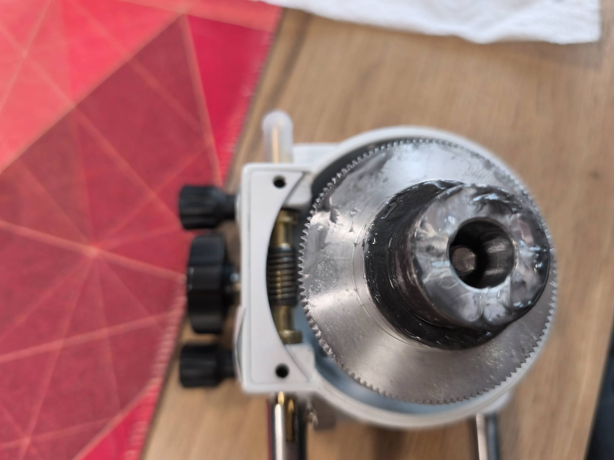</a>

<em>Removing the old silicone-based grease:</em>

<a href ="../photos/1000004250.jpg" target="_blank">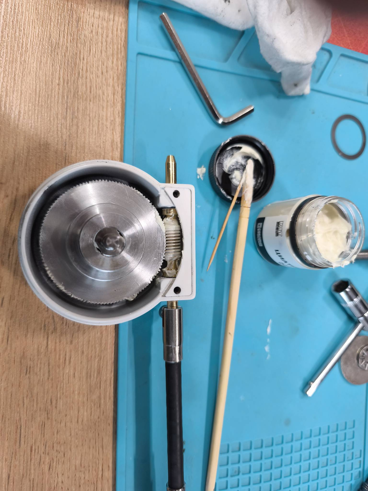</a>

<em>Applying aviation grease CIATIM-F:</em>

### Eliminating play
The play was eliminated by adding a 6*19 needle thrust bearing (2 mm thick) under the self-locking nut. The gap is adjusted experimentally so that the mount rotates freely enough while parasitic play is absent.

This upgrade requires no more serious mechanical modification of the mount.
The thread length is enough to tighten the nut, but for that the stock black and metal washers (which were right under the nut) must be removed and replaced with the bearing and the washer from the bearing kit.

The bearing kit includes 2 washers, but only 1 should be installed, since on the opposite side the bearing rests on the surface of the mount's factory "thick" washer.

The worm gear pairs should also be adjusted. The process is rather painstaking and requires some skill and experience. Since it does not affect pointing accuracy, if you have never done this procedure before, it is better to leave it alone.

<a href ="../photos/1000004953.jpg" target="_blank">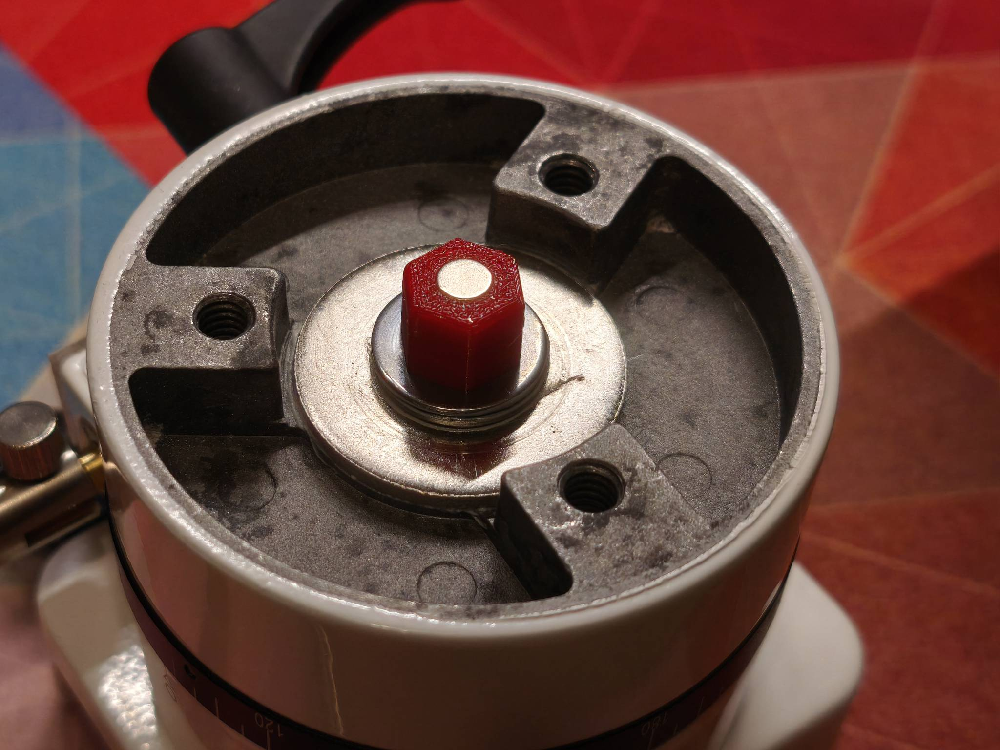</a>

<em>This photo shows the resulting "sandwich" (bottom to top: the thick washer from the mount, the needle thrust bearing, the washer from the bearing kit, the nut, and the magnet holder)</em>

## Upgrade

The main idea of the upgrade is to add magnetic encoders to the mount and read their values. The higher the encoder resolution, the more precisely you can point at objects.

Considering that this SV225 mount is used mostly for visual astronomy, and also taking into account the cost of encoders, I settled on MT6701 magnetic encoders. Their accuracy is 16,384 steps per full revolution, or 0.02 degrees.
The price as of 2025 is 100 rubles apiece (or $1). Theoretically various other encoders can be used, but the firmware would need to be modified.

It is better to buy the encoders mounted on a board, with the included magnet. These use special, rather rare radially magnetized magnets. Sourcing them separately is quite difficult.
The kit usually includes a 4 mm magnet, which is a workable option, but I found 6 mm magnets sold separately; the project has models for both variants.
A larger diameter should give better accuracy.

A gap of about 1–1.5 mm must be set between the magnet and the encoder sensor; for this the spacer washers were designed with a margin for possible adjustment (slightly larger).
To adjust the gap, shims of the required thickness are placed under the encoder board. The project contains a model 2 mm thick. You need to edit the thickness for your gap.

## 3D printing

Print the models:
- [Mount parts](../models/STL/parts)
- [Body](../models/STL/body)
- [Template for installing the encoder board](../models/STL/pattern)

PETG plastic with 15–20% infill was used for printing the parts. No problems with the mount's rigidity were noticed.

## Assembly

First, unscrew the 6 screws in the pictures below.

<a href ="../photos/1000004955.jpg" target="_blank">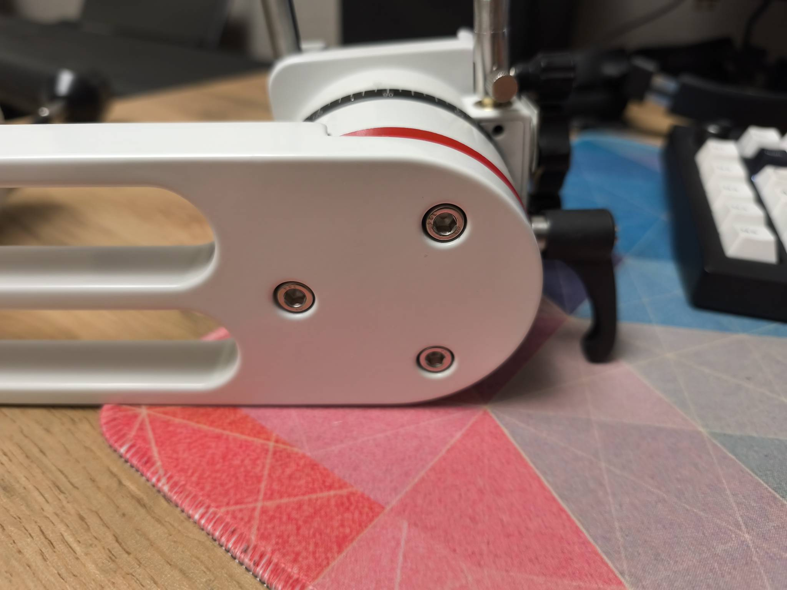</a>
<a href ="../photos/1000004956.jpg" target="_blank">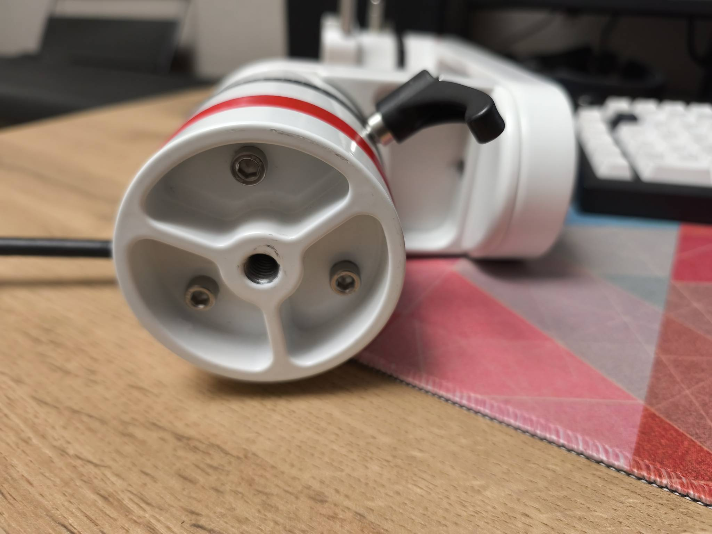</a>

<a href ="../photos/1000004013.jpg" target="_blank">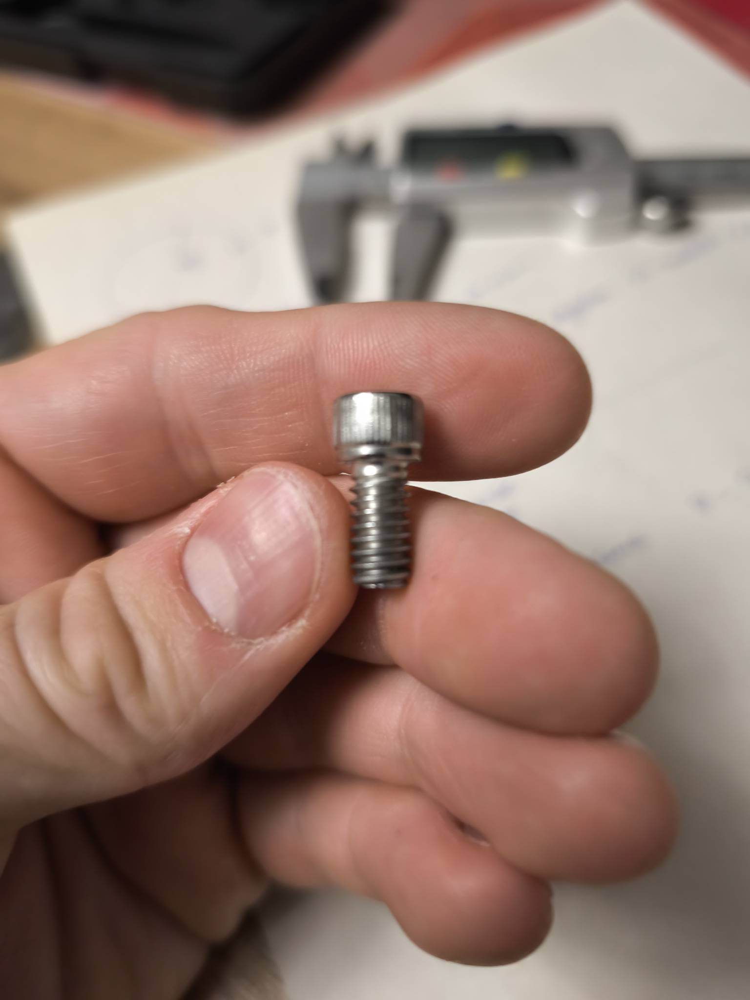</a>

<em>Unscrewed bolts</em>

<a href ="../photos/1000004951.jpg" target="_blank">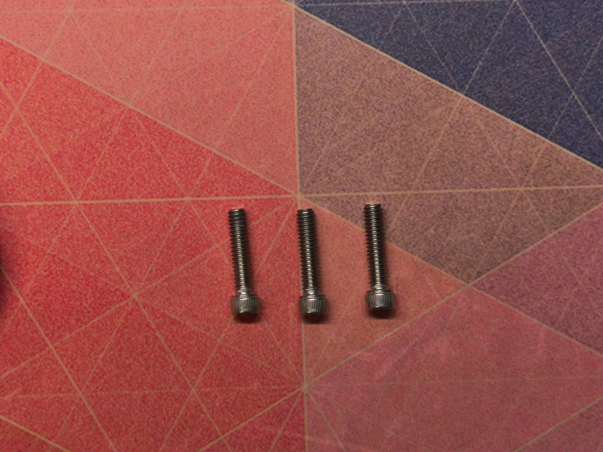</a>

<em>After the upgrade, longer bolts of size 1/4-20, length 1-1/8" must be installed (imperial system! I could only find them made to order on AliExpress)
</em>

Next we install the magnet holders (together with the magnets) on the nuts that lock the shafts:

<a href ="../photos/1000004011.jpg" target="_blank">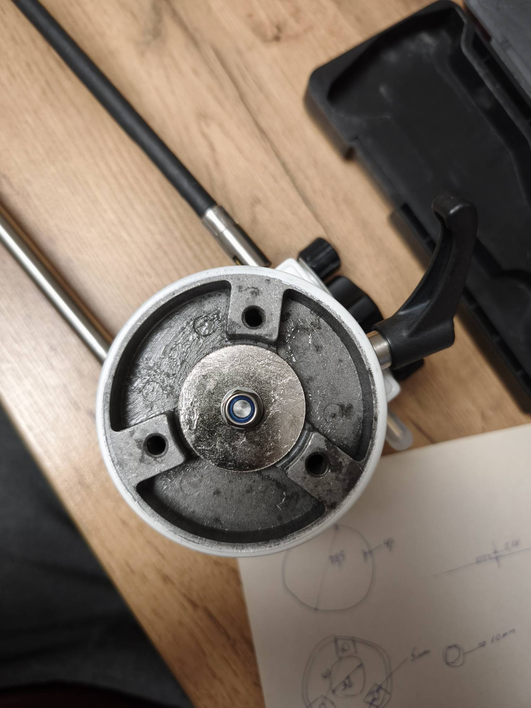</a>
<a href ="../photos/1000004952.jpg" target="_blank">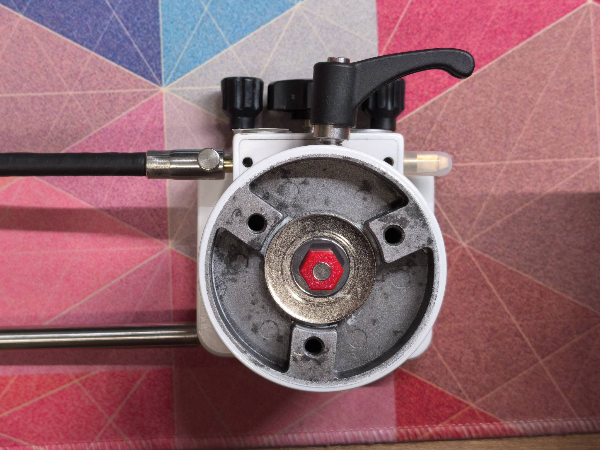</a>

To position the encoder precisely relative to the magnet, print the [3D template](../models/STL/pattern).
It helps install the encoder exactly centered relative to the shaft. The template must be inserted into the bolt holes; the central pin marks the point for installing the encoder.

<a href ="../photos/1000004012.jpg" target="_blank">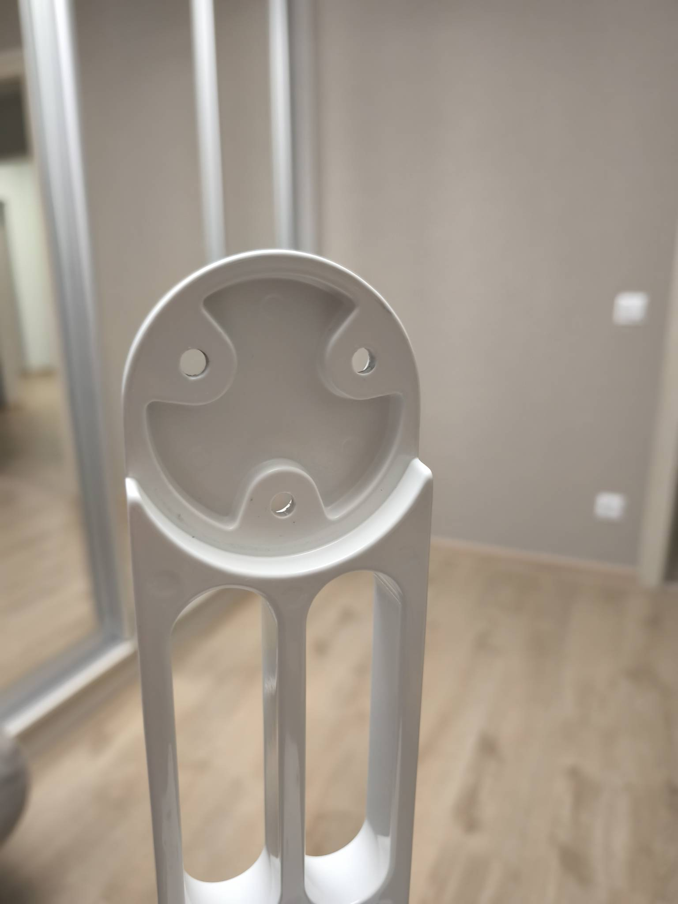</a>

<a href ="../models/STL/pattern/preview.png" target="_blank">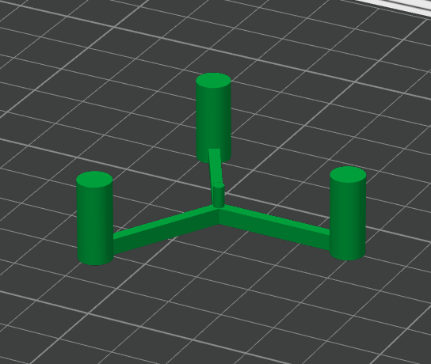</a>

<em>Template for precise encoder installation</em>

We install the encoder boards (with glue), having first measured the distance from the magnet to the encoder; the distance must be made up with shims (ideally it should be 1–1.5 mm).

<a href ="../photos/1000004288.jpg" target="_blank">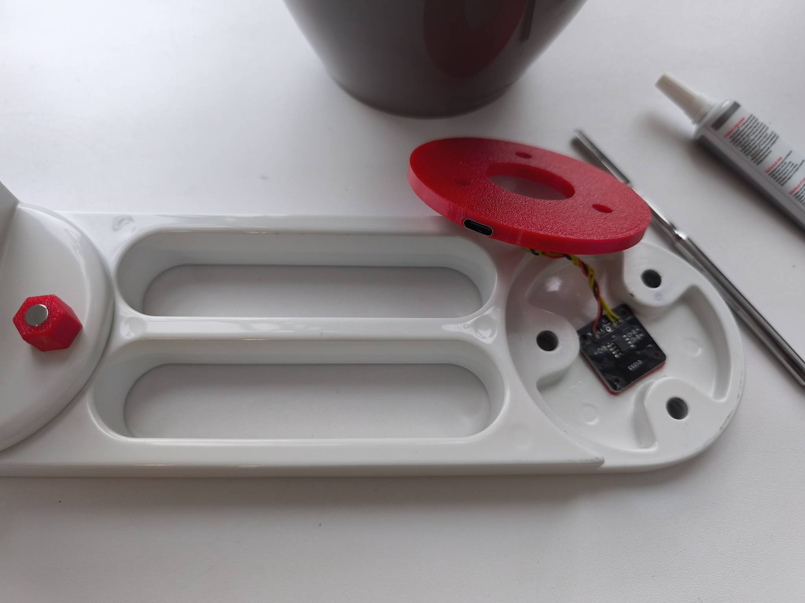</a>
<a href ="../photos/1000004287.jpg" target="_blank">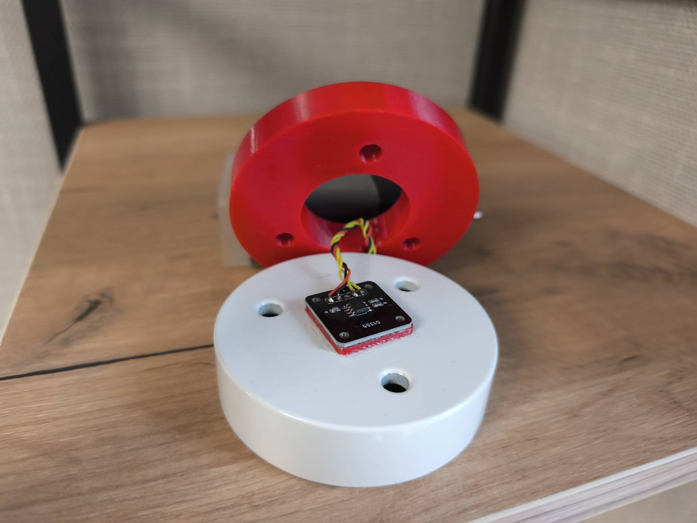</a>

We install the USB-C connectors into the slots on the spacer washers and connect them to the board with silicone wires.
4 wires in total: 2 for power, 2 for the I2C bus data.

<a href ="./img/usb-connector.png" target="_blank">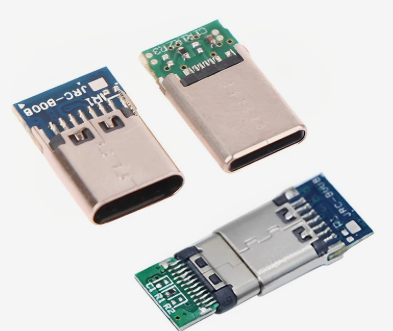</a>

<em>Connectors of this type must be installed</em>

Assemble the mount; the final result:

<a href ="../photos/1000004944.jpg" target="_blank">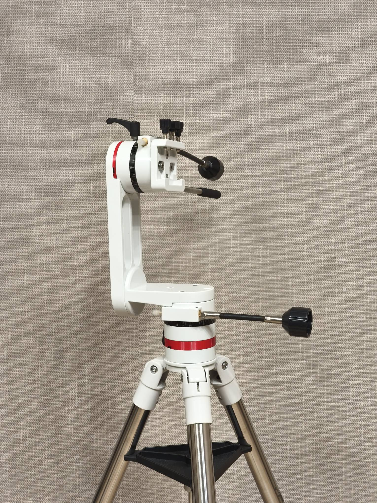</a>

## Flashing the firmware

The repository contains three firmwares: [stellarium_firmware.ino](../src/stellarium_firmware.ino) (Stellarium, USB),
[bluetooth_firmware.ino](../src/bluetooth_firmware.ino) and [wifi_firmware.ino](../src/wifi_firmware.ino) (SkySafari).
The procedure is fairly standard; if I find the time I will describe it in more detail later.

## ESP32 ↔ MT6701 wiring diagram

<a href ="./img/schema_connection.png" target="_blank">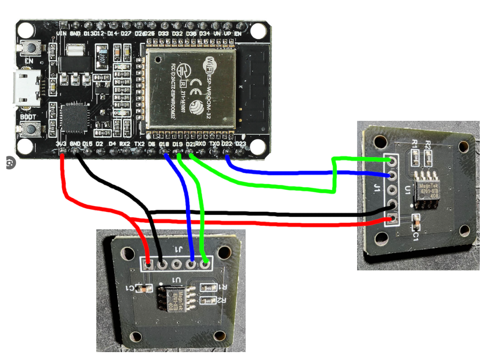</a>

<em>Wiring diagram of the ESP32 dev kit board with two MT6701 encoders</em>

Two I2C buses are used because these sensors have a fixed address that cannot be changed.

## ESP32 enclosure

In the minimal version you can do without an enclosure by assembling everything on a breadboard or free-form.

For those who want to build it like the author, print the [enclosure](../models/STL/body) and install the USB-C connectors in it.
Then connect the ESP32 and the connectors with silicone wires.

The mount and the board in its enclosure are connected to each other with any USB-C to USB-C cables.

## P.S.

Many moments could not be captured, much has been forgotten. But the general details from this guide should shed light on the main idea.

Always happy to get feedback, ask questions at https://t.me/redstar01
