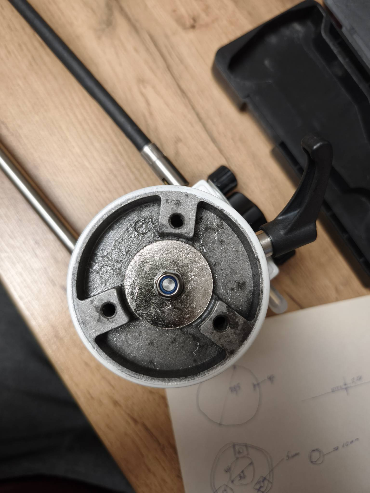
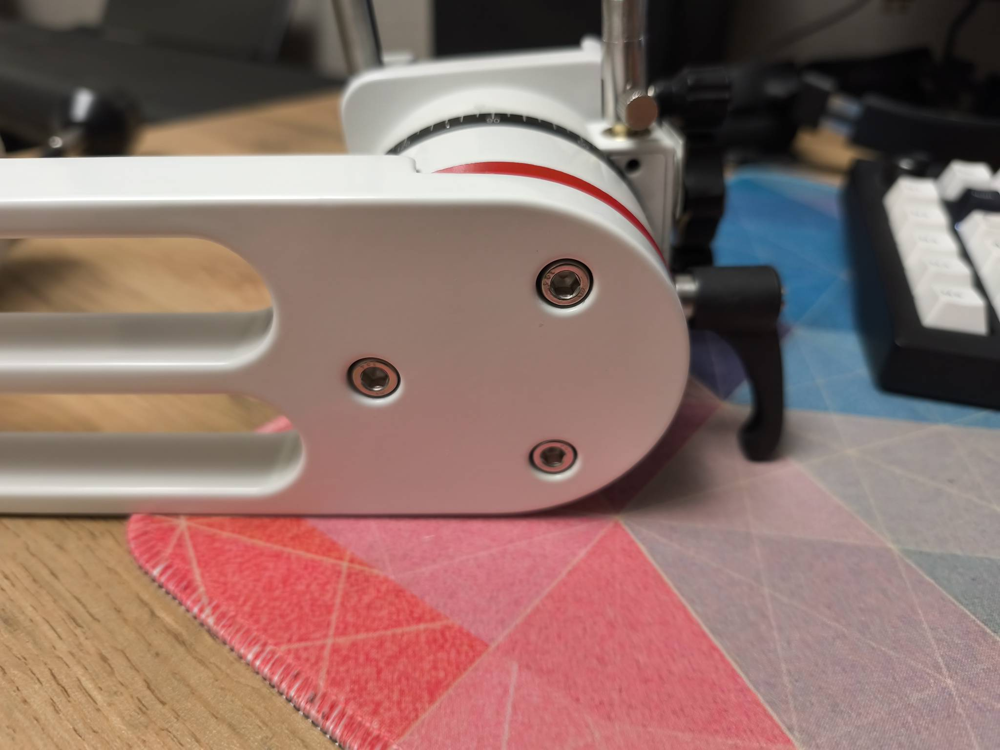

# Инструкция по доработке альт-азимутальной монтировки sv225 до PUSH-TO

## Предварительные работы
Перед модернизацией монтировки необходимо довести механику монтировки до возможного идеала, в моем случае я заменил смазку и избавился от люфтов путем добавления упорного подшипника.

### Замена смазки
Перед непосредственно сборкой необходимо полностью заменить заводскую смазку, так как заводская очень сильно дубеет на холоде уже при минимальных отрицательных значениях.
Рекомендуемая смазка ЦИАТИМ-F - наиболее дешевая из аналогов и не оказывающая сколь-либо значимого влияния на материал монтировки - алюминий.

### Устранение люфтов
Люфты получилось убрать путем добавления упорного игольчатого подшипника 6*19 (2мм толщина) под самоконтрящуюся гайку. Опытным путем устанавливается зазор, чтобы вращение монтировки было достаточно свободным, но в то же время не было паразитных люфтов.

При такой доработке не требуется механическая доработка монтировки, длины вала хватает если убрать штатную черную и металлическую шайбу (которые были сразу под гайкой) и заменить на подшипник и шайбу из набора с подшипником.

В наборе с подшипником идет 2 шайбы, а установить необходимо только 1, так как с противоположной стороны подшипник будет рабоать по поверхности толстой шайбы монтировки.

Так же стоит отрегулировать червячные пары - но на точность позиционирования не влияет. Если опыта нет, лучше не трогать.

 

## Модернизация

Основная идея модернизации монтировки состоит в добавлении магнитных энкодеров в монтировку и считывании показателей. Чем точнее энкодер, тем точнее получится наводиться на объекты.

Учитывая, что данную монтировку sv225 используют в большей степени для визуальной астрономии и также, беря во внимание стоимость энкодеров, я остановился на магнитных энкодерах MT6701. Точность которых равна 16,384 шагов на полный оборот, или 0,02 градуса. 
При стоимости на 2025 год равной 100 рублей за шт (или 1$).

Энкодеры лучше приобретать комплектом с магнитом и уже установленными на плате. Здесь используются специальные, довольно редкие магниты радиальной намагниченности. Достать их отдельно довольно сложно. 
В комплекте, как правило, находится магнит на 4мм, что вполне является рабочим вариантом, но я нашел отдельно в продаже на 6мм, в проекте есть модели под оба варианта.
С большим диаметром точность должна быть лучше.

Между магнитом и датчиком энкодера необходимо выставить зазор в районе 1-1.5мм, для этого проставки были спроектированы с запасом под возможную регулировку (немного больше).
Для регулировки зазора под плату подставляются необходимой толщины подкладки. В проекте находится модель с толщиной 2мм. Требуется отредактировать толщину под ваш зазор.

## 3D печать

Для печати деталей использовался petg пластик с заполнением 15-20%. Каких-либо проблем с жесткостью монтировки замечено не было.

## Сборка

Первым делом откручиваем 6 болтов на рисунках ниже

