# Инструкция по доработке альт-азимутальной монтировки sv225 до PUSH-TO

## Предварительные работы
Перед модернизацией монтировки необходимо довести механику монтировки до возможного идеала, в моем случае я заменил смазку и избавился от люфтов путем добавления упорного подшипника.

### Замена смазки
Перед непосредственно сборкой, необходимо полностью заменить заводскую смазку, так как с завода она сильно дубеет на холоде уже при минимальных отрицательных значениях температуры.
Рекомендуемая смазка ЦИАТИМ-F - наиболее дешевая из аналогов и не оказывающая сколь-либо значимого влияния на алюминий из которого изготовлена монтировка.

<a href ="../photos/1000004130.jpg" target="_blank">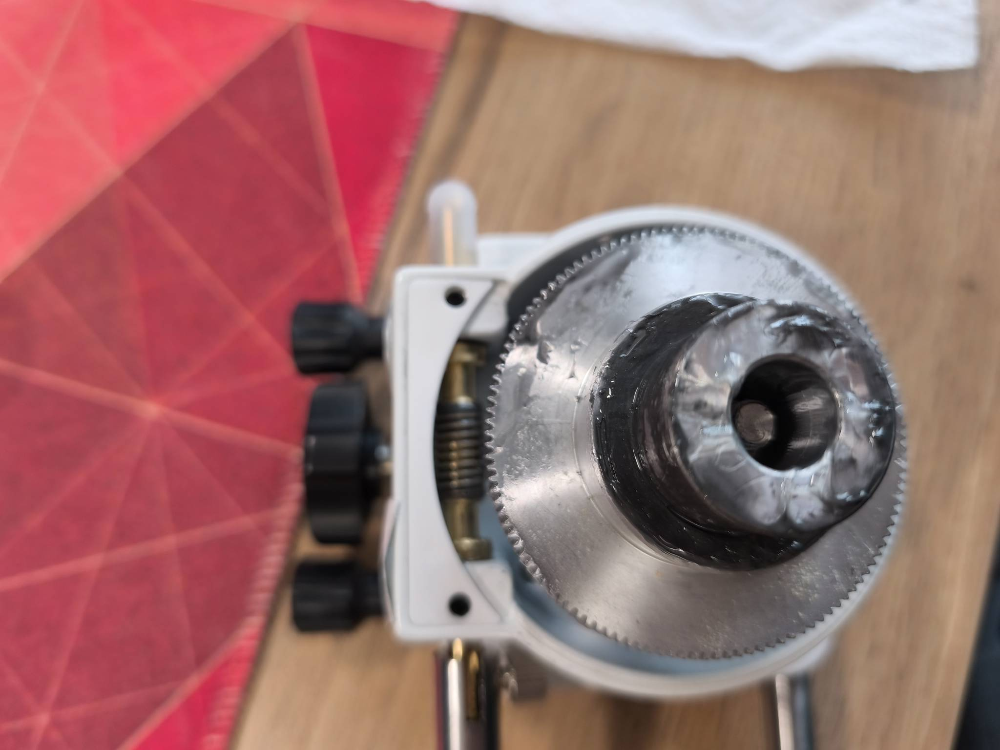</a>

<em>Снимаем старую смазку на силиконовой основе:</em>

<a href ="../photos/1000004250.jpg" target="_blank">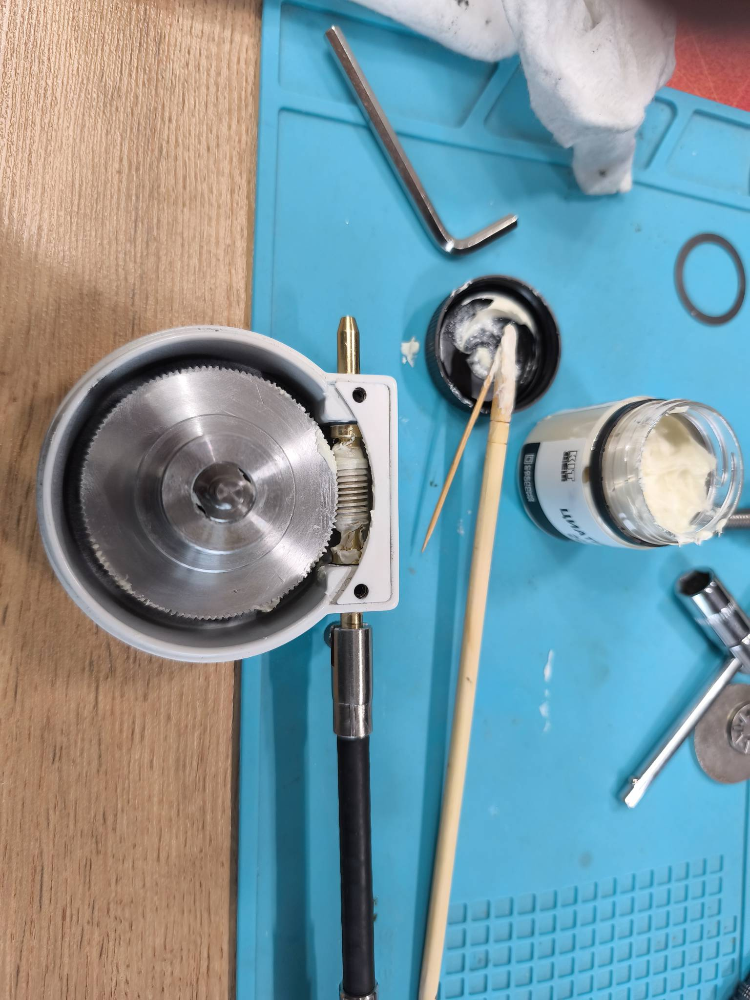</a>

<em>Смазываем авиационной смазкой ЦИАТИМ-F:</em>

### Устранение люфтов
Люфты получилось устранить путем добавления упорного игольчатого подшипника 6*19 (2мм толщина) под самоконтрящуюся гайку. Опытным путем устанавливается зазор, чтобы вращение монтировки было достаточно свободным, но в то же время отсутствовали паразитные люфты.

При данной модернизации не требуется какая-либо более серьезная механическая доработка монтировки. 
При этом хватает длины резьбы для затяжки гайки, но для этого необходимо убрать штатную черную и металлическую шайбу (которые были сразу под гайкой) и заменить на подшипник и шайбу из набора с подшипником.

В наборе с подшипником идет 2 шайбы, но установить необходимо только 1, так как с противоположной стороны подшипник будет опираться на поверхность заводской "толстой" шайбы монтировки.

Также стоит отрегулировать червячные пары. Процесс довольно кропотливый и требует определенной сноровки и опыта. Так как на точность позиционирования не влияет, если ранее не доводилось осуществлять данную процедуру, то лучше не трогать.

<a href ="../photos/1000004953.jpg" target="_blank">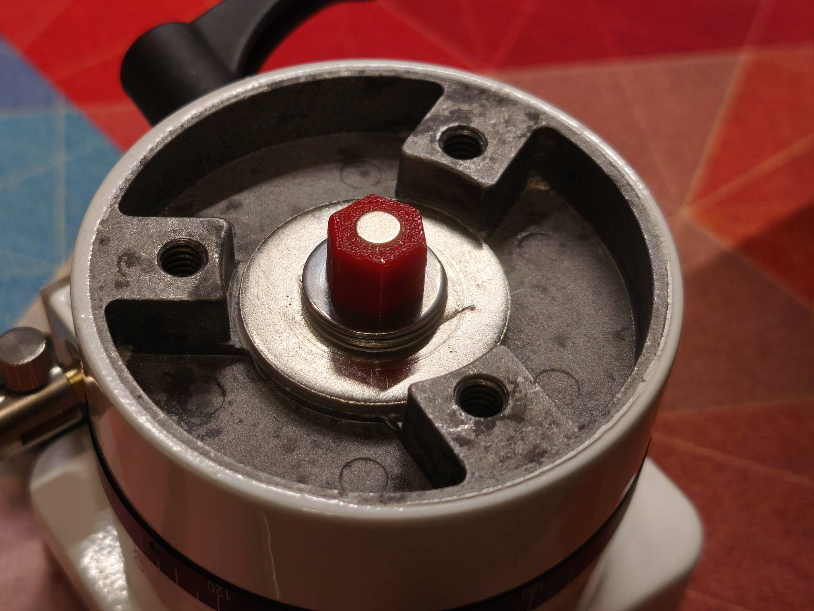</a>

<em>На данном фото видно получившийся "бутерброд" (снизу-вверх: толстая шайба от монтировки, упорный игольчатый подшипник, шайба из комплекта подшипника, гайка, и держатель магнита)</em>

## Модернизация

Основная идея модернизации монтировки состоит в добавлении магнитных энкодеров в монтировку и считывании их показателей. Чем больше разрешение энкодера, тем точнее получится наводиться на объекты.

Учитывая, что данную монтировку sv225 используют в большей степени для визуальной астрономии, а также, беря во внимание стоимость энкодеров, я остановил свой выбор на магнитных энкодерах MT6701. Точность которых равна 16,384 шагов на полный оборот, или 0,02 градуса. 
Стоимость на 2025 год равна 100 рублей за шт (или 1$). Теоретически можно использовать различные другие энкодеры, но потребуется доработка программного кода.

Энкодеры лучше приобретать установленными на плате, с комплектным магнитом. Здесь используются специальные, довольно редкие магниты радиальной намагниченности. Достать их отдельно довольно сложно. 
В комплекте, как правило, находится магнит на 4мм, что является работоспособным вариантом, но я нашел в продаже отдельно магниты 6мм, в проекте есть модели под оба варианта.
С большим диаметром точность должна быть лучше.

Между магнитом и датчиком энкодера необходимо выставить зазор в районе 1-1.5мм, для этого шайбы-проставки были спроектированы с запасом под возможную регулировку (немного больше).
Для регулировки зазора под плату энкодера подставляются необходимой толщины подкладки. В проекте находится модель с толщиной 2мм. Требуется отредактировать толщину под ваш зазор.

## 3D печать

Распечатываем модели:
- [Детали монтировки](../models/STL/parts)
- [Корпус](../models/STL/body)
- [Шаблон для установки платы энкодера](../models/STL/pattern)

Для печати деталей использовался petg пластик с заполнением 15-20%. Каких-либо проблем с жесткостью монтировки замечено не было.

## Сборка

Первым делом откручиваем 6 винтов на рисунках ниже

<a href ="../photos/1000004956.jpg" target="_blank">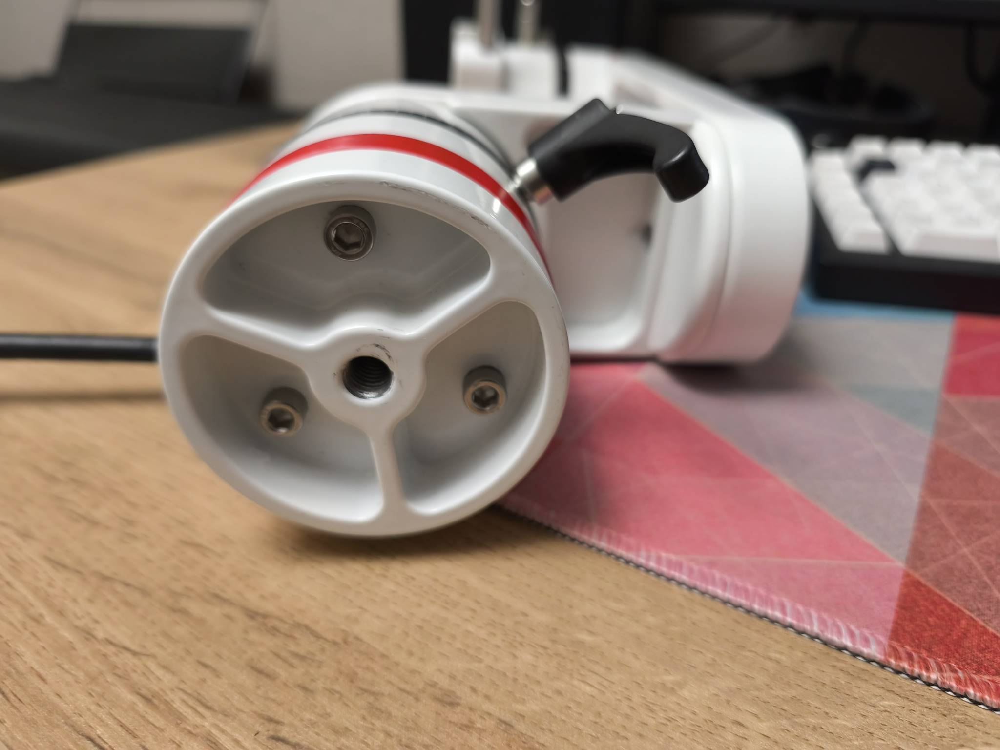</a>

<a href ="../photos/1000004013.jpg" target="_blank">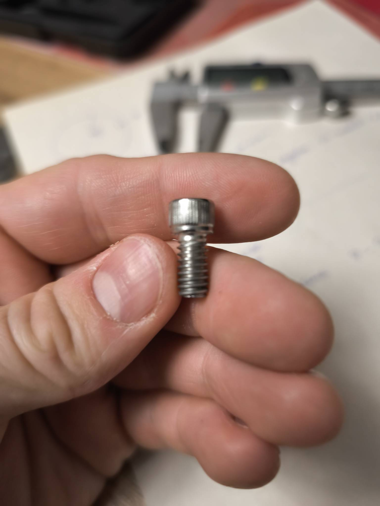</a>

<em>Выкрученные болты</em>

<a href ="../photos/1000004951.jpg" target="_blank">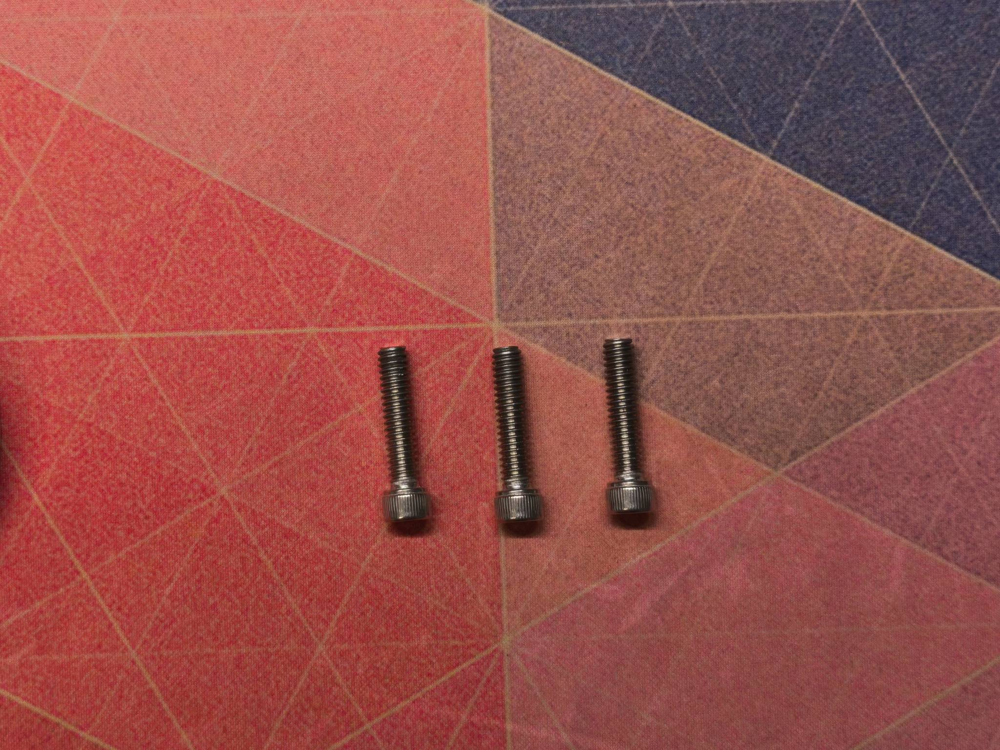</a>

<em>После модернизации необходимо установить большей длины размер 1/4-20, длинна 1-1/8" (дюймовая система! Нашел только под заказ на али)
</em>

Далее устанавливаем держатели магнитов (вместе с магнитами) на гайки, которые фиксируют валы:

<a href ="../photos/1000004952.jpg" target="_blank">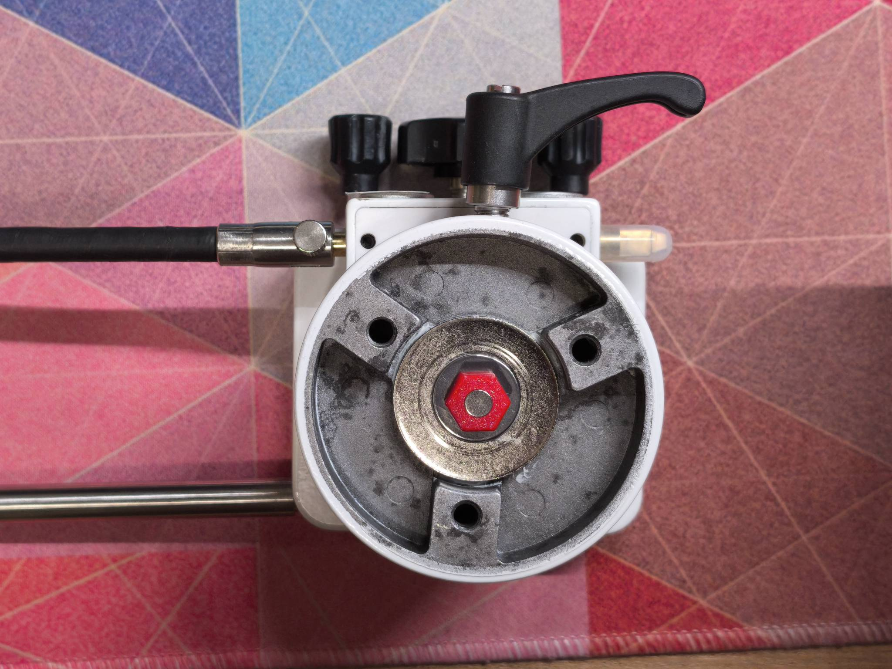</a>

Для точного позиционирования энкодера относительно магнита необходимо распечатать  [3d шаблон](../models/STL/pattern). 
Он поможет установить энкодер ровно по центру относительно вала. Шаблон необходимо вставить в отверстия от болтов, центральный штырь укажет точку для установки энкодера.

<a href ="../photos/1000004012.jpg" target="_blank">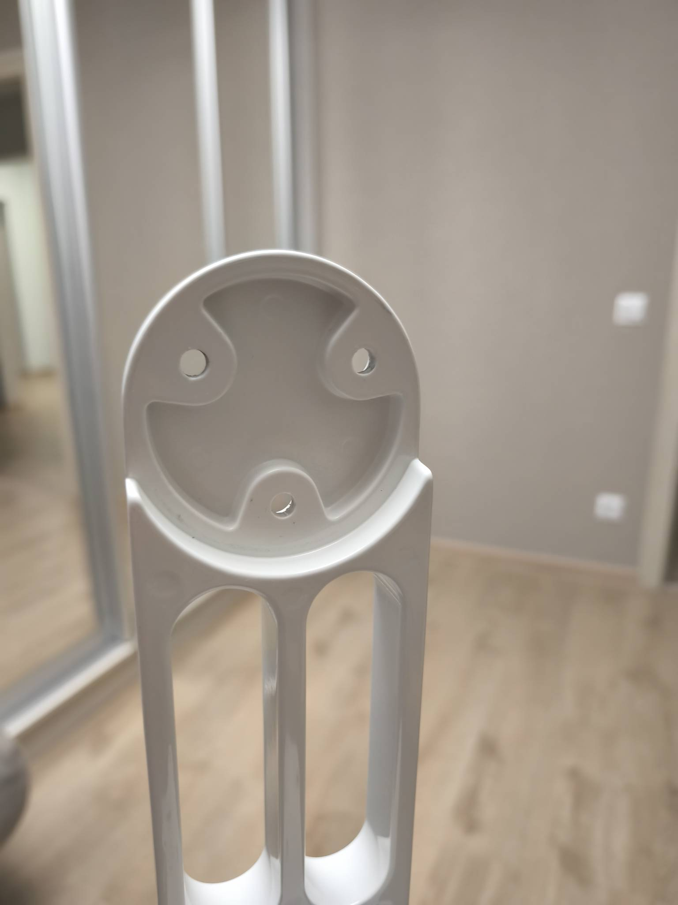</a>

<a href ="../models/STL/pattern/preview.png" target="_blank">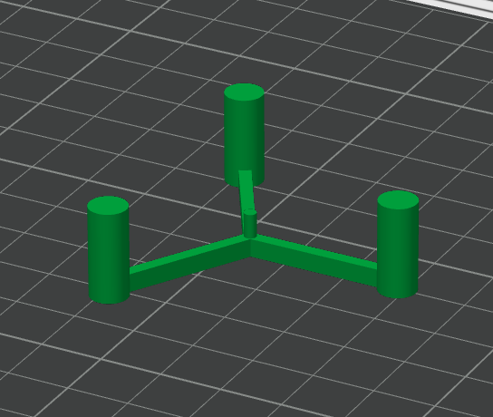</a>

<em>Шаблон для точной установки энкодера</em>

Устанавливем платы с энкодерами (на клей), предварительно измерив расстояние от магнита до энкодера, расстояние необходимо добрать подкладками. (в идеале должно быть 1-1.5 мм).

<a href ="../photos/1000004288.jpg" target="_blank">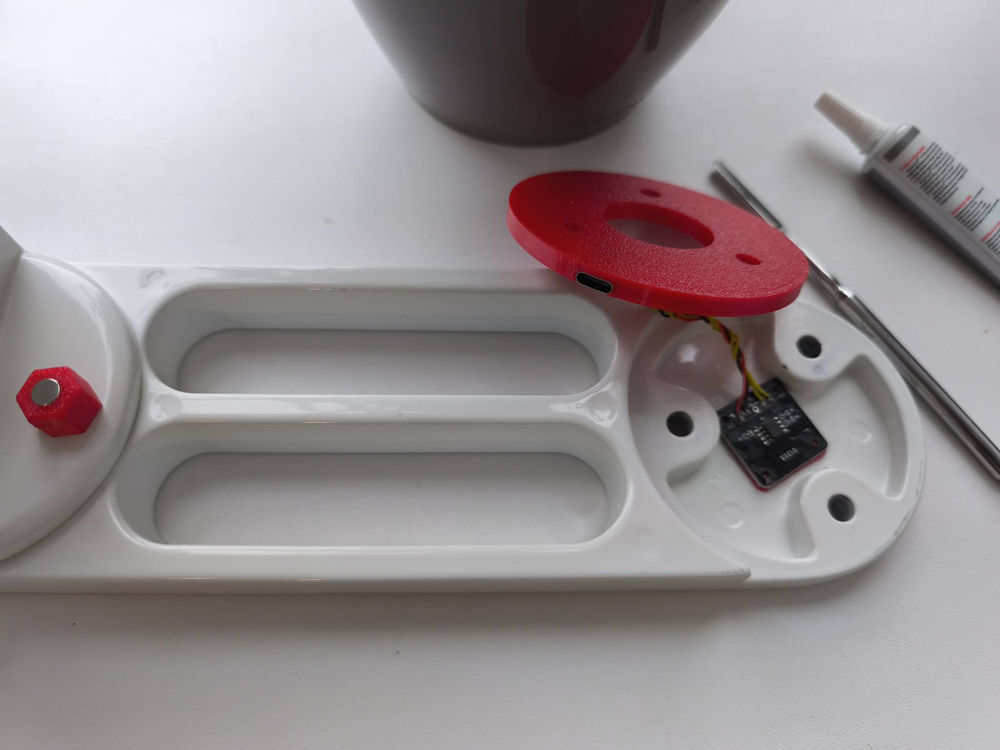</a>
<a href ="../photos/1000004287.jpg" target="_blank">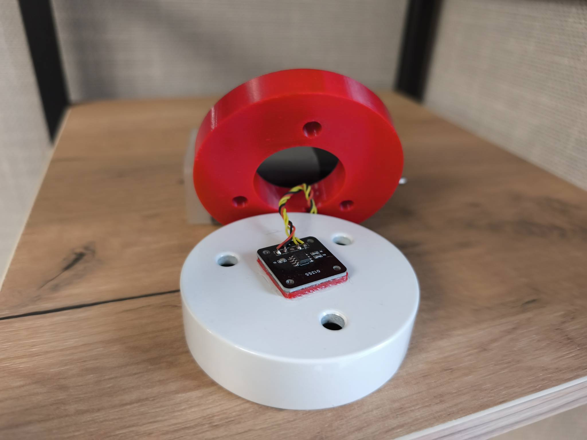</a>

В пазы на шайбах-проставках устанавливаем USB-C коннекторы, силиконовыми проводами соединяем с платой.
Всего 4 провода, 2 - питание, 2 - данные I2C шины.

<a href ="./img/usb-connector.png" target="_blank">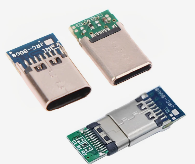</a>

<em>Необходимо установить коннекторы данного типа</em>

Собираем монтировку, конечный результат:

<a href ="../photos/1000004944.jpg" target="_blank">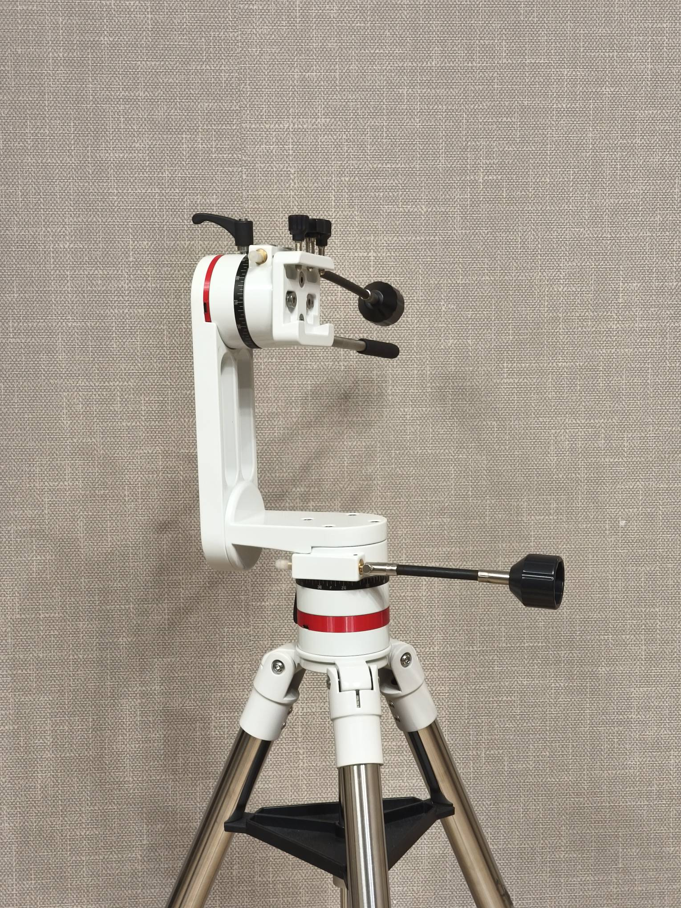</a>

## Заливка прошивки

Необходимо прошить ESP32 одной из предложенных прошивок под коннект через bluetooth или wifi.
Процедура довольно стандартная, если появится время опишу ее подробнее позже. Приоритет отдал версии bluetooth, так как при данном способе соединения остается свободный wifi и доступ в интернет.

## Схема соединения ESP32 c MT6701

<a href ="./img/schema_connection.png" target="_blank">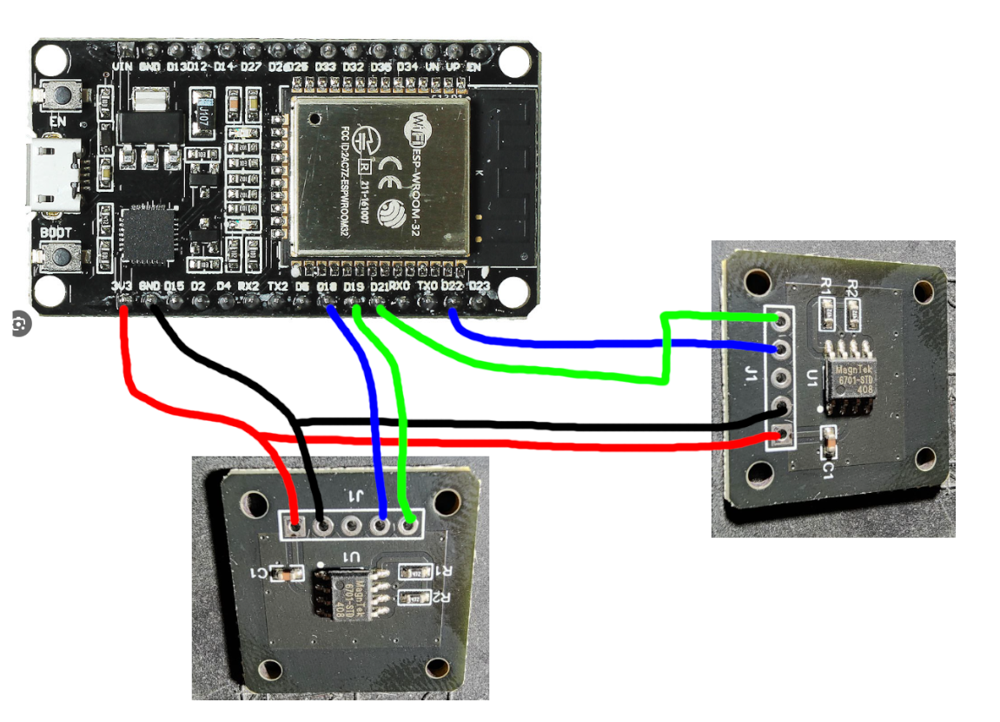</a>

<em>Схема соединения платы ESP32 dev kit с двумя энкодерами MT6701</em>

Используются 2 шины I2C, так как данные датчики имеют фиксированный адрес, который нельзя изменить.

## Корпус для ESP32

В минимальной версии можно обойтись без корпуса, собрав все на макетной плате или навесным методом.

Для тех, кто хочет сделать как у автора, распечатайте [корпус](../models/STL/body) и установите в него USB-C коннекторы.
Далее силиконовыми проводами соедините ESP32 и коннекторы.

Монтировка и сама плата в корпусе соединяются между собой любыми USB-C to USB-C кабелями.

## P.S.

Многие моменты не удалось зафиксировать, многое забылось. Но общие детали из данной инструкции должны пролить свет на главную идею.

Всегда рад обратной связи, задавайте вопросы https://t.me/redstar01
