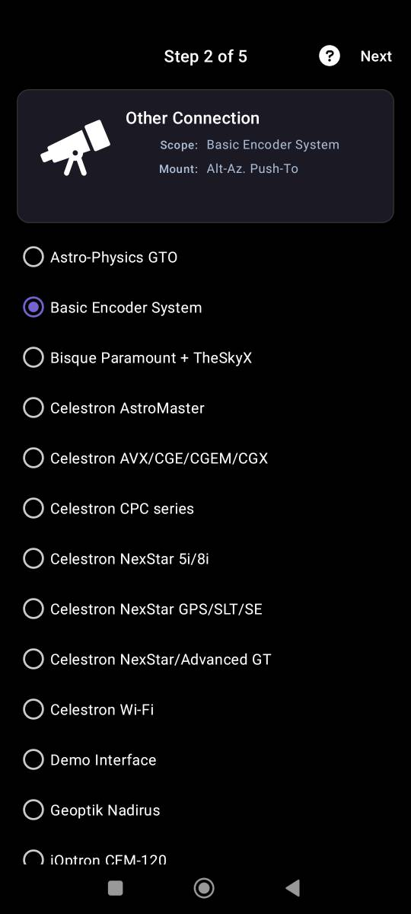
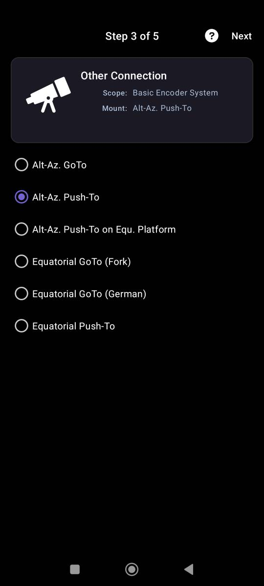
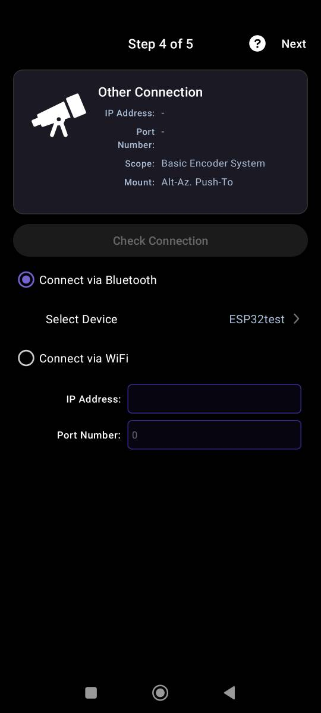
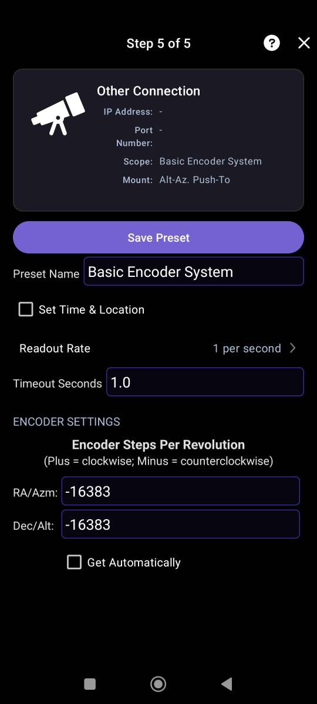

# Connecting the mount to SkySafari

🌐 [Русский](skysafari_connection.md) | **English**

In the SkySafari settings you need to add a telescope using the Basic Encoder System protocol. Then follow the steps in the screenshots below.

<em>Select the Basic Encoder System protocol</em>

<em>Mount type Alt-Az. Push-To</em>

<em>Choose the connection type depending on the firmware flashed. For Wi-Fi: ip: 192.168.4.1, port: 80</em>

<em>Specify the encoder step count, -16383 (with a minus sign)</em>

