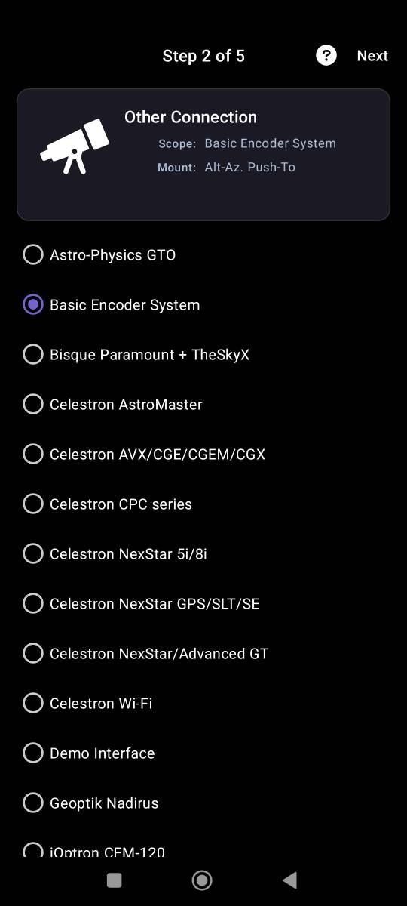
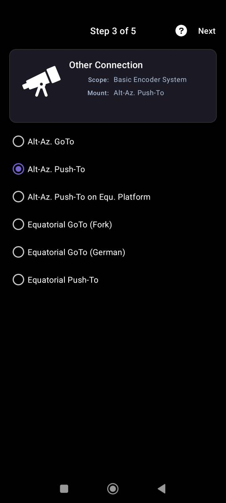
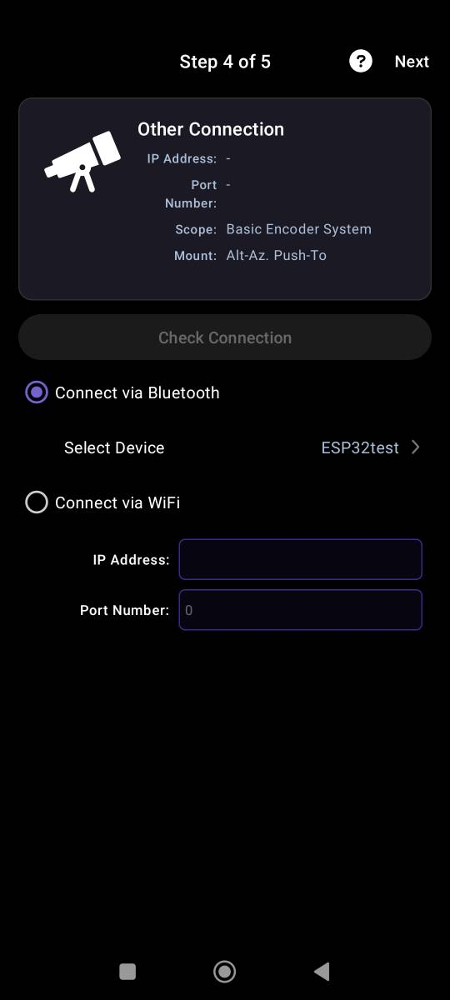
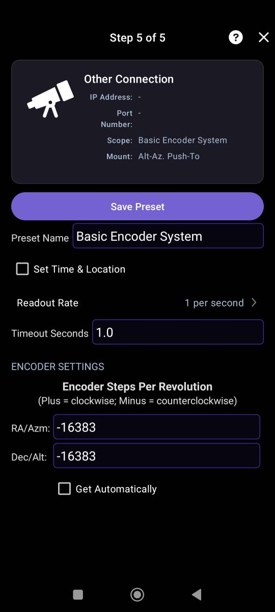

# Подключение монтировки к программе SkySafari

В настройках программы SkySafari необходимо добавить телескоп по протоколу Basic Encoder System. Далее идем по шагам из скринов ниже

<em>Выбираем протокол Basic Encoder System</em>

<em>Тип монтировки Alt-Az. Push-To</em>

<em>Выбираем в зависимости от залитой прошивки тип подключения. Для wifi: ip: 192.168.4.1, порт: 80</em>

<em>Указываем кол-во шагов энкодеров, -16383 (со знаком минус)</em>

